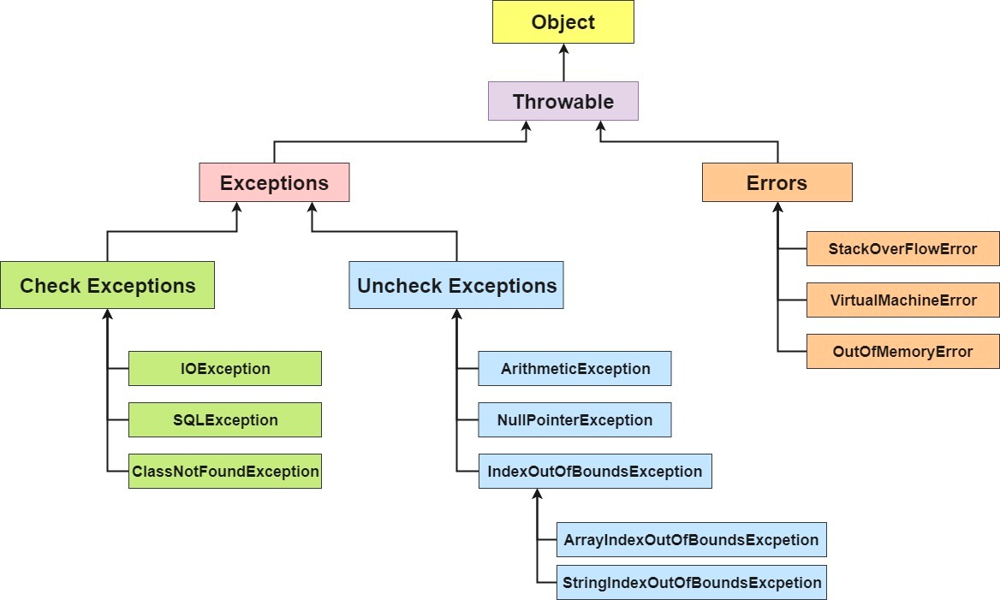

# Exception Handling

### Q) What is an exception?
The exception is an abnormal condition that occurs during the execution of a program and disrupts the normal flow of the program. If not handled properly it can cause the program to terminate abruptly.

### Q) Hierarchy of Exception Handling?


### Q) Difference between Exception VS Error

Here's a table that shows the difference between Error and Exception in Java:

| Error                                                                           | Exception                                                                                          |
|---------------------------------------------------------------------------------|----------------------------------------------------------------------------------------------------|
| An error is an irrecoverable condition occurring at runtime.                    | An exception is a condition that occurs at runtime and represents an error in the program's logic. |
| Errors are mostly caused by the environment in which an application is running. | Exceptions are mostly caused by the application itself.                                            |
| Errors are unchecked exceptions.                                                | Exceptions can be checked or unchecked.                                                            |
| Errors cannot be handled or caught.                                             | Exceptions can be handled and caught using try-catch blocks.                                       |    
| java.lang.Error                                                                 |     java.lang.Exception.                                                                                               |


### Q) How do we handle exceptions in Java
`try`
Encloses set of statements which can throw exception hence are required to be monitored.

`catch`
When exception occur, this block catches that exception and work accordingly to handle it or to throw it as required.

`finally`
This block gets executed always regardless of exception occurrence. Hence clean up is done here.

Here's an example of how to use try-catch blocks to handle exceptions:

```java
try {
  // code that might throw an exception
}catch (Exception e) {
  // code to handle the exception
}finally(){
    //something
}
```


### Q) Can we write only try block without catch and finally blocks?

No. `either catch or finally is must`. It will throw **compilation error**


### Q) Can we write any other statements between try catch or finally block?

No. Try must be followed directly by either catch or finally.

### Q) Does remaining statements in try block executes after exception occurs.

No. if exception occurs at a particular point in try block then all statements after that statement where exception is occurred will not be execute and the flow goes directly to either catch block if there is any or else program terminates. Hence we need finally block to do all clean up like closing files or removing locks.

### Q) What Is the Difference Between Throw and Throws Keywords in Exception Handling in java?.

The keyword `throw` is used inside method body to invoke an exception and `throws` clause is used in method declaration (signature) ¹.

If we see syntax wise then `throw` is followed by an instance variable and `throws` is followed by exception class names ¹.

Here's a table summarizing the differences between `throw` and `throws` in Java:

|        | throw                                          | throws                                 |
|--------|------------------------------------------------|----------------------------------------|
| Usage  | Used inside method body to invoke an exception | Used in method declaration (signature) |
| Syntax | Followed by an instance variable               | Followed by exception class names      |

Here's an example of how to use `throw`:

```java
public class Example {
    public static void main(String[] args) {
        int age = 17;
        if (age < 18) {
            throw new ArithmeticException("Age must be greater than or equal to 18");
        }
    }
}
```

Here's an example of how to use `throws`:

```java
public class Example {
    public static void main(String[] args) throws ArithmeticException {
        int age = 17;
        if (age < 18) {
            throw new ArithmeticException("Age must be greater than or equal to 18");
        }
    }
}
```

### Q) What Happens When an Exception Is Thrown by the Main Method?

As there is no one to handle the exception, Java Runtime `terminates` the program and prints the exception message and the stack trace in-system console.

```java
class MainExceptionExample{
    public static void main(String[] args) {
        throw new RuntimeException("Can someone handle this");
    }
}
```

### Q) What do you understand by `unreachable catch block error`.
This error comes when you keep super classes first and sub classes later. Like here We kept Exception which is parent of NullPointer Exception first.

Hence the order of catch blocks must be from most specific to most general ones. 

```java
class ExceptionExample{
    public static void main(String[] args) {
        try {
            
        }catch (Exception e){} //It should be at the bottom 
        catch (NullPointerException e){}//It will never reach here as the super class is above
    }
}
```
### Q) What is **Multi catch block statement**

When the return type of several exception is same, thus we use multicatch block to reduce boiler-plate coding.

```java
import java.io.IOException;

class MultiCatch {
    public static void main(String[] args) {
        try {

        } catch (NullPointerException | IOException e){
            // using | symbolysing OR
        }
    }
}
```

### Q) Difference between final, finally, and finalize

Here's a table that shows the difference between final, finally and finalize in Java:

| final                                                                                                 | finally                                                                                                       | finalize                                                                                                                                  |
|-------------------------------------------------------------------------------------------------------|---------------------------------------------------------------------------------------------------------------|-------------------------------------------------------------------------------------------------------------------------------------------|
| `final` is an access modifier that can be used to apply restrictions on a class, method, or variable. | `finally` is a block in exception handling that is executed regardless of whether an exception occurs or not. | `finalize` is a method of the object class that is invoked by the garbage collector before an object is removed from memory.              |
| `final` can be applied to classes, methods, and variables.                                            | `finally` is used to execute important code such as closing database connections or streams.                  | `finalize` is used to perform clean-up processing before an object is removed from memory.                                                |
| `final` variables cannot be changed once they are initialized.                                        | `finally` blocks are always executed after the try block and any catch blocks have completed.                 | The `finalize` method should be overridden by any class that needs to perform clean-up processing before the object is garbage collected. |

```java
public class Example {
  final int x = 10; //value cannot change, method cannot be ovverriden
  
  public static void main(String[] args) {
    try {
      // code that might throw an exception
    } catch (Exception e) {
      // code to handle the exception
    } finally {
      // important code that should always be executed
    }
    protected void finalize() {
          // Garbage colleciton: clean-up processing to free the resource
    }
  }
}

```

### Q) What is Exception Propagation or Exception Chaining?

Exception propagation in Java occurs when an exception is thrown from the top of the stack. 
When it is not caught, the exception drops down the call stack of the preceding method. If it is not caught there, it further drops down to the previous method1. 
After a method throws an exception, the runtime system attempts to find something to handle it2. This process continues until either an appropriate exception handler is found or the exception reaches the bottom of the call stack

```java

public class Example {
  public static void main(String[] args) {
    try {
      method1();
    } catch (Exception e) {
      System.out.println(e); //Handling here
    }
  }

  public static void method1() throws Exception {
    method2();
  }

  public static void method2() throws Exception {
    method3();
  }

  public static void method3() throws Exception {
    throw new Exception("Exception thrown from method3");
  }
}

```

The same thing can happen, where when we are working with Spring Boot, where the repo will send a exception, which if not handled by service, it will through the exception then thrown to controller etc. 

### Q) What is Chained Exception

In Java, a chained exception is a technique that enables programmers to associate one Exception with another. By providing additional information about a specific exception, debugging can be made easier. 
A chained exception is created by wrapping an existing exception in a new exception, which becomes the root cause of the new Exception

Mehtods of `Throwable` class which support chained exception: 
- `getCause()` method: This method return actual cause of an exception
- `initCause(Throwable casue)` method: This method set the cause for the calling exception

```java

try {
    // some code that throws an exception
} catch (Exception e) {
    throw new RuntimeException("Something went wrong", e);
}

```

### Q) What is the difference between checked and unchecked exception

Differences between checked and unchecked exceptions in Java:

When the .java file is compiled to .class so that the `bytecode` is created, at this time the checked exception is checked. 

| Checked Exceptions                                                       | Unchecked Exceptions                                                             |
|--------------------------------------------------------------------------|----------------------------------------------------------------------------------|
| Checked by `compiler` hence called `compile time` exception.             | Not check by compiler and cause `Runtime Exception`                              |
| The Java Virtual Machine requires the exception to be caught or handled. | The Java Virtual Machine does not require the exception to be caught or handled. |
| `Must` be handled in `try-and-catch` block, or be `throws`               | Exception handling semantics are not required .                                  |
| FileNotFoundException , IOException                                      | NullPointerException, Arthematic Exception                                       |
| Why must to handle- As it's having a **high failure chance**             | As it is **programming mistake**                                                 |

Unchecked Exception is `child` to CheckedException. 

### Q) Exception Handling in Spring Boot. 